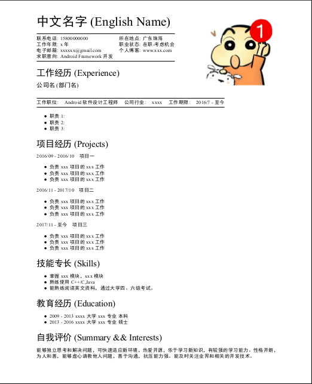

# Resume

This is an open-source project that use MarkDown to generate resume.Just run the shell as below:

```
./run.sh
```

then the pdf type resume will generated.Make sure Zathura is installed in your Computer.

```
.
├── demo.md //resume Markdown file
├── output
│   └── resume.pdf // pdf generated by Markdown
├── portrait
│   └── portrait.png //Personal photo
├── README.md
├── run.sh //the shell that generated the Pdf
└── templates
    └── resume-template.latex// the Templates that for Resume
```

the final effect is as below:


